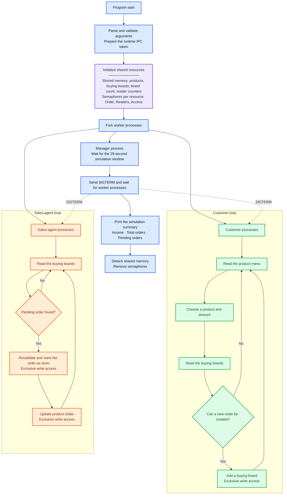

# Shop Simulator

[](https://github.com/Yurii-Kor/Shop-Simulator/actions/workflows/shop-simulation.yml)

A concurrent shop simulation written in C using processes, POSIX threads, System V shared memory, and semaphores.

The project demonstrates a writer-aware, turnstile-based approach to the [readers–writers problem](https://en.wikipedia.org/wiki/Readers%E2%80%93writers_problem): multiple readers may access shared data concurrently, while writers receive exclusive access.

<details open>
<summary><strong>How the simulation works</strong></summary>

<br>

The manager process initializes the shared resources, starts customer and sales-agent processes, controls the simulation lifetime, and performs the final cleanup.



### Diagram legend

* **Blue** — manager lifecycle and application control.
* **Purple** — shared IPC resources.
* **Green** — customer operations.
* **Orange** — sales-agent operations.

</details>

<details>
<summary><strong>Process roles</strong></summary>

<br>

### Manager

The parent process:

* validates the simulation configuration;
* creates shared memory and semaphores;
* starts customer and sales-agent processes;
* controls the simulation duration;
* terminates and waits for child processes;
* prints the final result;
* removes all IPC resources.

### Customers

Each customer runs in a separate process and repeatedly:

1. reads the shared product menu;
2. chooses a product and amount;
3. reads the shared buying board;
4. checks the status of the previous order;
5. optionally adds a new order.

Product and buying-board reads may run concurrently with other readers. Adding an order requires exclusive writer access.

### Sales agents

Each sales agent runs in a separate process and repeatedly:

1. reads the shared buying board;
2. searches for a pending order;
3. revalidates the selected order under exclusive access;
4. marks the order as completed;
5. updates the total number of ordered products.

Revalidation prevents two sales agents that observed the same pending order from processing it twice.

</details>

<details>
<summary><strong>Synchronization model</strong></summary>

<br>

The products and buying board are independent shared resources.

Each resource uses three System V semaphores:

| Semaphore | Responsibility                                                               |
| --------- | ---------------------------------------------------------------------------- |
| `Order`   | Acts as a turnstile and prevents new readers from bypassing a waiting writer |
| `Readers` | Protects the shared active-reader counter                                    |
| `Access`  | Provides exclusive writer access and is held collectively by active readers  |

### Reader flow

The first reader locks `Access`, allowing subsequent readers to enter concurrently.

The final active reader releases `Access`.

```text
lock Order
lock Readers

if first reader:
    lock Access

increment reader count

unlock Readers
unlock Order

read shared data

lock Readers
decrement reader count

if last reader:
    unlock Access

unlock Readers
```

### Writer flow

A writer first closes the `Order` turnstile and then waits for exclusive access.

```text
lock Order
lock Access
unlock Order

modify shared data

unlock Access
```

While the writer is waiting for active readers to finish, new readers cannot bypass it through the turnstile.

This provides:

* concurrent access for readers;
* exclusive access for writers;
* protection of shared reader counters;
* resistance to writer starvation.

The synchronization model is based on the classic [readers–writers problem](https://en.wikipedia.org/wiki/Readers%E2%80%93writers_problem).

</details>

<details>
<summary><strong>Shared resources</strong></summary>

<br>

The simulator maintains two main shared data areas.

### Products

The product storage contains:

* product ID;
* product name;
* price;
* total ordered amount.

Customers read the product list, while sales agents update order totals.

### Buying boards

The buying-board storage contains:

* board ID;
* customer ID;
* product ID;
* requested amount;
* completion status.

Customers add new boards, while sales agents find and complete pending orders.

### Reader counters

Active-reader counters are also stored in shared memory so that all forked processes observe the same synchronization state.

The simulator creates its System V IPC key source automatically at runtime:

```text
.runtime/ipc.token
```

No manually prepared key files are required.

</details>

<details>
<summary><strong>Build and run</strong></summary>

<br>

The simulator is intended for Linux or WSL and requires GCC with POSIX thread support.

### Compile

```bash
gcc \
  -std=gnu11 \
  -Wall \
  -Wextra \
  -Wpedantic \
  -pthread \
  shop_simulator.c \
  -o shop-simulator
```

### Run with default values

```bash
./shop-simulator
```

The default configuration is:

| Argument     | Default | Allowed range |
| ------------ | ------: | ------------: |
| Products     |      10 |          1–10 |
| Sales agents |       2 |           1–4 |
| Customers    |       4 |          1–10 |

### Run with custom values

Arguments must be passed in this order:

```text
products sales-agents customers
```

Example:

```bash
./shop-simulator 5 2 4
```

The simulation runs for approximately 29 seconds.

At the end, it prints:

* total income;
* total number of boards;
* number of pending orders;
* final product statistics;
* final buying-board contents.

### Stop the simulation manually

Press:

```text
Ctrl+C
```

The manager will request graceful termination, wait for all worker processes, print the current summary, and remove the IPC resources.

</details>

<details>
<summary><strong>GitHub Actions demo</strong></summary>

<br>

The `Shop Simulation` workflow contains two dependent jobs.

### Build simulator

The build job:

* checks out the repository;
* compiles the source using GCC;
* enables strict compiler warnings;
* treats warnings as build errors;
* uploads the compiled executable as an artifact.

### Run simulation

The simulation job:

* starts only after a successful build;
* downloads the compiled executable;
* runs the simulator with a timeout;
* records the console output;
* verifies that the final summary was produced;
* uploads the simulation log as an artifact.

The workflow runs automatically for pushes and pull requests.

### Run the workflow manually

To run the simulator with custom parameters:

1. fork this repository;
2. open the **Actions** tab in the fork;
3. select **Shop Simulation**;
4. choose **Run workflow**;
5. enter the desired number of products, sales agents, and customers.

GitHub Actions then compiles and executes the simulator in a Linux environment.

</details>

<details>
<summary><strong>Project structure</strong></summary>

<br>

```text
Shop-Simulator/
├── .github/
│   └── workflows/
│       └── shop-simulation.yml
├── .gitignore
├── README.md
└── shop_simulator.c
```

| File                                    | Purpose                                                                     |
| --------------------------------------- | --------------------------------------------------------------------------- |
| `shop_simulator.c`                      | Simulation, process management, shared memory, semaphores, and worker logic |
| `.github/workflows/shop-simulation.yml` | Automated compilation and simulation workflow                               |
| `.gitignore`                            | Excludes runtime files, local binaries, and generated logs                  |
| `README.md`                             | Project documentation                                                       |

</details>

<details>
<summary><strong>Project background</strong></summary>

<br>

This project was originally created as an operating-systems and concurrency exercise.

It was later refactored to improve:

* interprocess readers–writers synchronization;
* protection of shared counters;
* concurrent order revalidation;
* IPC resource management;
* argument validation;
* graceful process shutdown;
* automated compilation and execution through GitHub Actions.

The project is intended as an educational demonstration of process coordination and shared-resource synchronization in C.

</details>
